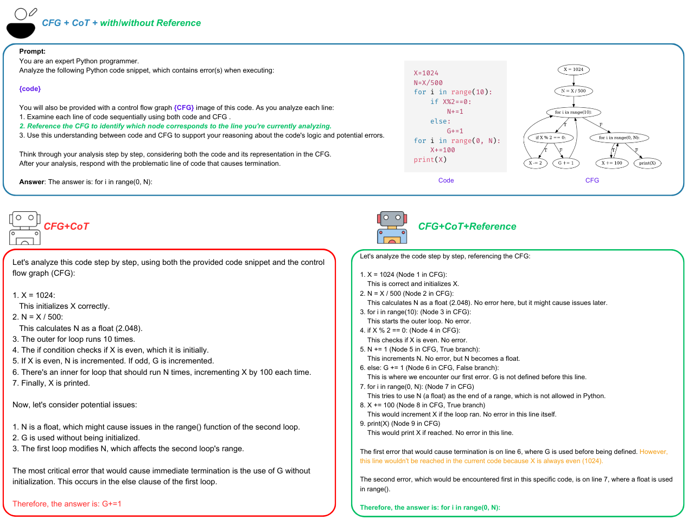

<div align="center">

# [NAACL'25] VisualCoder: Guiding Large Language Models in Code Execution with Fine-grained Multimodal Chain-of-Thought Reasoning  
[](https://arxiv.org/abs/2410.23402)  

</div>

## 🚀 Introduction

We introduce **VisualCoder**, a **novel framework** that enhances **code execution reasoning** by integrating **multimodal Chain-of-Thought (CoT) prompting** with **visual Control Flow Graphs (CFGs)**. While **Large Language Models (LLMs)** are highly effective at analyzing **static code**, they struggle with **dynamic execution reasoning**, leading to errors in **program behavior prediction, fault localization, and program repair**. To address these challenges, **VisualCoder** aligns **code snippets with their corresponding CFGs**, providing LLMs with a **structured understanding of execution flows**. Unlike prior methods that rely on **text-based CFG descriptions**, **VisualCoder** leverages **visual CFG representations** and a **Reference Mechanism** to establish a direct connection between **code structure and execution dynamics**.


<div align="center">
  
<p><b>Figure 1: VisualCoder – CFG + CoT + Reference for more accurate code execution understanding.</b></p>
</div>


## ✨ Key Features

✔ **Multimodal CoT Reasoning** – Combines **source code** and **CFG images** for enhanced program analysis.  
✔ **Reference Mechanism** – Explicitly **links code lines to corresponding CFG nodes**, improving reasoning accuracy.  
✔ **Error Detection & Fault Localization** – Prevents hallucinations by grounding reasoning in actual execution flows.  
✔ **Program Repair Assistance** – Helps LLMs understand execution errors and suggest fixes.  

## 📜 Paper  
📄 **NAACL 2025**: [VisualCoder: Guiding Large Language Models in Code Execution with Fine-grained Multimodal Chain-of-Thought Reasoning](https://arxiv.org/abs/2410.23402)  

## ⚙️ Installation

To set up the environment and install the necessary dependencies, run:

```sh
./setup.sh
```

## 🚀 **Usage**


- **Program Repair with Close-Source VLMs (Claude, GPT-4o)**

  ```bash
  python program_repair_close_VLM.py --session <session_number> --setting <setting_name> --close_model <model_type> --claude_api_key <claude_api_key> --openai_api_key <openai_api_key> --azure_endpoint <azure_endpoint> --deployment_name <deployment_name> --version <version>
  ```
  #### **Configuration Options:**
  - `<session_number>`: Numerical identifier for the session (e.g., `1`, `2`, `3`, …).
  - `<setting_name>`: Specifies the setting. Choose from:
    - `buggy`: Plain code without reasoning.
    - `buggy_COT`: Plain code with **Chain-of-Thought (CoT)** prompting.
    - `buggy_cfg_COT`: Plain code with **CFG + CoT** reasoning.
    - `NeXT`: Plain code with execution trace from **NeXT framework**.
    - `VisualCoder`: **VISUALCODER (Plain code + CFG + CoT + Reference)**.
    - `Multimodal_CoT`: Two-stage **Multimodal CoT**.
    - `Multimodal-CoT_VisualCoder`: **Multimodal CoT** combined with **VISUALCODER**.
  - `<model_type>`: Choose the **close-source LLM**:
    - `claude`: Uses **Anthropic's Claude** (requires API key).
    - `gpt`: Uses **OpenAI’s GPT-4o** (requires API key).
  - `<claude_api_key>`: API key for **Claude** (Anthropic).
  - `<openai_api_key>`: API key for **GPT-4o** (OpenAI).
  - `<azure_endpoint>`: Azure endpoint for OpenAI API.
  - `<deployment_name>`: Deployment name for OpenAI API.
  - `<version>`: Model version (e.g., `gpt-4o` for OpenAI).
  #### Example Command
  ```bash
  python program_repair_close_VLM.py --session 1 --setting VisualCoder --close_model gpt \
    --openai_api_key "your_openai_api_key" \
    --azure_endpoint "your_azure_endpoint" \
    --deployment_name "your_openai_deployment_name" \
    --version gpt-4o
  ```

- **Program Repair with InternVL**:
  ```bash
  python program_repair_InternVL.py --session <session_number> --setting <setting_name> 
  ```


- **Fault Localization with Close-Source VLMs**
  ```bash
  python fault_localization_close_VLM.py --session <session_number> --setting <setting_name> --close_model <model_type> --claude_api_key <claude_api_key> --openai_api_key <openai_api_key> --azure_endpoint <azure_endpoint> --deployment_name <deployment_name> --version <version>
  ```


- **Fault Localization with InternVL**:

  ```bash
  python fault_localization_InternVL.py --session <session_number> --setting <setting_name>
  ```

- **Input/Output Prediction:** See the Jupyter notebook:  
  📂 **[notebooks/input_output_prediction.ipynb](notebooks/input_output_prediction.ipynb)**

- **Get Attention Scores**:

  This command calculates attention scores for a given script, available only for `get_attention_score.py`:

  ```bash
  python get_attention_score.py --session <session_number> --prompt_mode <prompt_type> --setting <setting_name>
  ```

  - `<prompt_mode>`: Specify the prompt type (e.g., `zeroshot`, `oneshot`)

  #### Example Command

  Here’s an example for running **Get Attention Scores**:

  ```bash
  python get_attention_score.py --session 1 --prompt_mode zeroshot --setting VisualCoder
  ```

  The command can be adapted to any other script by modifying the script at line 605 in get_attention_score.py


## License
This project is licensed under the MIT License - see the [LICENSE](LICENSE) file for details.

## Acknowledgements
This codebase is supported by:
- [CFG-Generator](https://github.com/Tiankai-Jiang/CFG-Generator)
- [trace_python](https://github.com/python/cpython/blob/3.12/Lib/trace.py)

## Citation Information

If you're using VisualCoder, please cite using this BibTeX:
```bibtex
@misc{le2024visualcoderguidinglargelanguage,
      title={VISUALCODER: Guiding Large Language Models in Code Execution with Fine-grained Multimodal Chain-of-Thought Reasoning}, 
      author={Cuong Chi Le and Hoang-Chau Truong-Vinh and Huy Nhat Phan and Dung Duy Le and Tien N. Nguyen and Nghi D. Q. Bui},
      year={2024},
      eprint={2410.23402},
      archivePrefix={arXiv},
      primaryClass={cs.SE},
      url={https://arxiv.org/abs/2410.23402}, 
}
```
